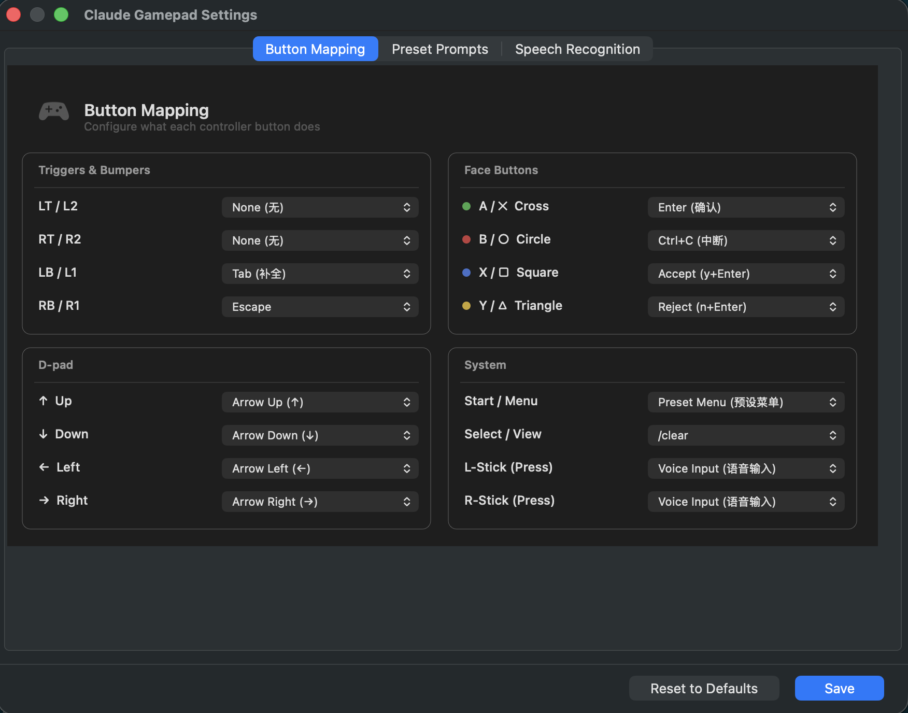
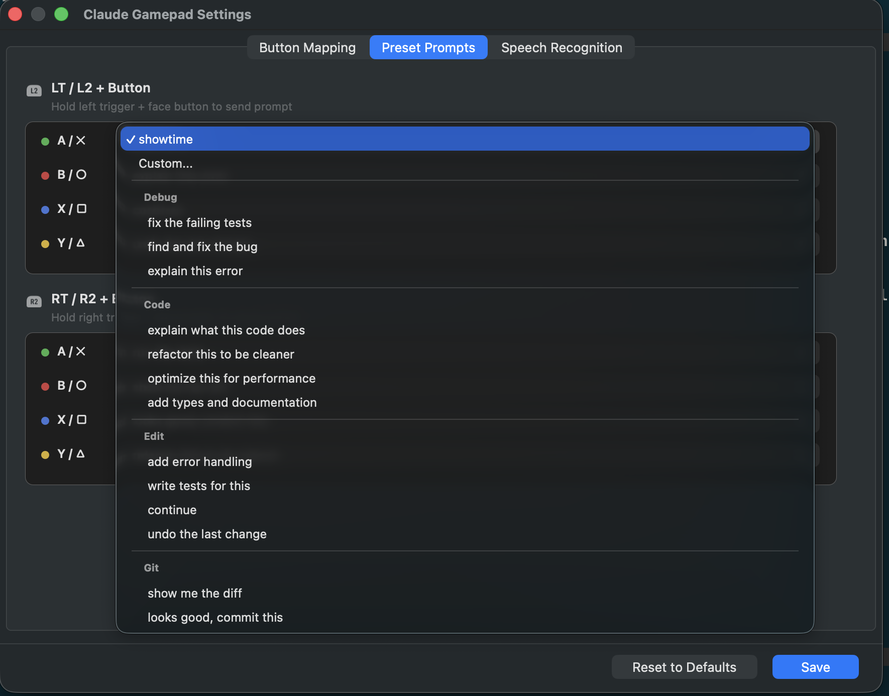
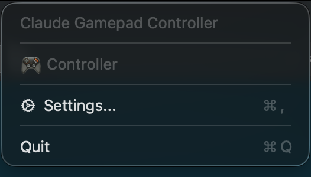
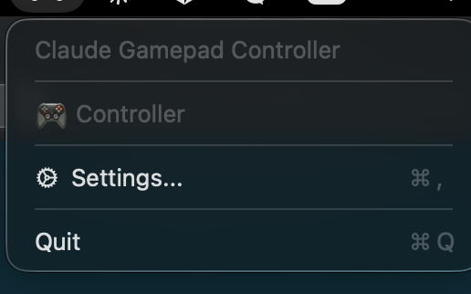

# Claude Gamepad Controller

A native macOS menu bar app that lets you control [Claude Code](https://claude.ai/claude-code) with a game controller. Lean back, vibe code from your couch.

Supports Xbox, PS5 DualSense, and any MFi-compatible controller. Includes voice input via Apple Speech Recognition or local [whisper.cpp](https://github.com/ggerganov/whisper.cpp), with optional LLM-powered speech correction.

## Features

- **Menu bar app** - runs in the background, no Dock icon
- **Plug and play** - auto-detects Xbox / PS5 / MFi controllers via `GCController`
- **Full button mapping** - every button configurable via GUI settings
- **Voice input** - press stick to speak, transcription pasted to terminal
  - System speech recognition (zero setup)
  - Local whisper.cpp (higher quality, offline)
  - Optional LLM refinement (Ollama / OpenAI compatible)
- **Quick prompts** - LT/RT + face button sends preset prompts
- **Preset menu** - Start button opens D-pad-navigable prompt list
- **Floating HUD** - non-intrusive overlay shows button feedback and transcription
- **macOS native** - pure Swift + AppKit, no Electron, no Python needed

## Default Button Mapping

| Button | Action |
|--------|--------|
| A / ✕ | Enter (confirm) |
| B / ○ | Ctrl+C (interrupt) |
| X / □ | Accept (y + Enter) |
| Y / △ | Reject (n + Enter) |
| D-pad | Arrow keys |
| LB / L1 | Tab (autocomplete) |
| RB / R1 | Escape |
| Stick Click | Voice input |
| Start / Menu | Preset prompt menu |
| Select / View | `/clear` |
| LT + Face | Quick prompt (configurable) |
| RT + Face | Quick prompt (configurable) |
| LT + RT + Select | Quit |

All mappings are fully customizable in Settings.

## Screenshots

### Button Mapping

Configure what each controller button does with the visual settings panel.



### Quick Prompts

Assign preset or custom prompts to trigger combinations. Presets are organized by category (Debug, Code, Edit, Git).



### Speech Recognition

Choose between system speech or local whisper.cpp. One-click install and model download.



### Menu Bar

The app lives in your menu bar. Green icon when a controller is connected.



## Installation

### Requirements

- macOS 14.0 (Sonoma) or later
- A game controller (Xbox, PS5 DualSense, or MFi compatible)
- For Whisper: `brew install whisper-cpp` (optional)

### Build from Source

```bash
git clone https://github.com/xargin/claude-controller.git
cd claude-controller
swift build -c release
# Binary at .build/release/ClaudeGamepad
```

### Run

```bash
swift run
```

Or build and copy to Applications:

```bash
swift build -c release
cp .build/release/ClaudeGamepad /usr/local/bin/
```

## First Launch

1. Run `swift run` or the built binary
2. Grant **Accessibility** permission when prompted (System Settings > Privacy & Security > Accessibility) - needed for keyboard simulation
3. Grant **Speech Recognition** permission if using voice input
4. Connect your controller - the menu bar icon turns active
5. Focus your terminal running Claude Code
6. Start pressing buttons!

## Configuration

Click the menu bar icon > **Settings** to open the settings window.

### Button Mapping Tab

Assign any action to any button. Available actions:
- Enter, Ctrl+C, Accept (y), Reject (n)
- Tab, Escape, Arrow keys
- Voice Input, Preset Menu, /clear
- Quit, None

### Quick Prompts Tab

Each trigger combo (LT+A, RT+B, etc.) can be assigned:
- A **preset prompt** from categorized lists (Debug, Code, Edit, Git)
- A **custom prompt** you type yourself

Default presets:

| Category | Prompts |
|----------|---------|
| Debug | fix the failing tests, find and fix the bug, explain this error |
| Code | explain what this code does, refactor this to be cleaner, optimize this for performance, add types and documentation |
| Edit | add error handling, write tests for this, continue, undo the last change |
| Git | show me the diff, looks good commit this |

### Speech Recognition Tab

**Engine**: Choose between:
- **System** - Apple's built-in speech recognition, works out of the box
- **Whisper** - Local whisper.cpp, better accuracy, works offline

**Whisper Setup**:
1. Click "Install (brew)" to install whisper-cpp via Homebrew
2. Select a model size (tiny 75MB to large-v3 3.1GB)
3. Click "Download" - progress bar shows download status

**LLM Refinement** (optional):
- Post-processes speech with a local LLM to fix recognition errors
- Supports Ollama, LM Studio, or any OpenAI-compatible API
- Fixes Chinese homophones, English technical terms, punctuation

## Voice Input Flow

1. Press **Stick Click** (L3 or R3)
2. Floating HUD shows "Listening..."
3. Speak your prompt (auto-detects Chinese and English)
4. HUD shows transcription with `[A=confirm B=cancel]`
5. Press **A** to paste to terminal, or **B** to cancel

## Architecture

```
Sources/ClaudeGamepad/
  main.swift              # Entry point, menu bar app setup
  AppDelegate.swift       # Status bar icon, menu, permissions
  GamepadManager.swift    # GCController input handling + button mapping
  KeySimulator.swift      # CGEvent keyboard simulation
  SpeechEngine.swift      # Apple SFSpeechRecognizer integration
  WhisperEngine.swift     # Local whisper.cpp CLI integration
  LLMRefiner.swift        # Optional LLM speech post-processing
  OverlayPanel.swift      # Floating HUD panel
  ButtonMapping.swift     # Button action config + persistence
  SpeechSettings.swift    # Speech/LLM config + persistence
  GamepadConfigView.swift # Visual button mapping settings UI
  SettingsWindow.swift    # Settings window with tabs
```

## Migrating from Python Version

This project was originally a Python script (`gamepad_claude.py`). The Swift rewrite provides:

| | Python | Swift |
|---|---|---|
| Install | `pip install` 5 packages | Double-click or `swift run` |
| Voice | Whisper (download model) | System speech (zero setup) or Whisper |
| Controller | pygame (SDL) | GCController (native) |
| Feedback | Terminal print | Floating HUD panel |
| Config | `--init` CLI wizard | GUI settings window |
| Runtime | Terminal command | Menu bar app |

## License

MIT
